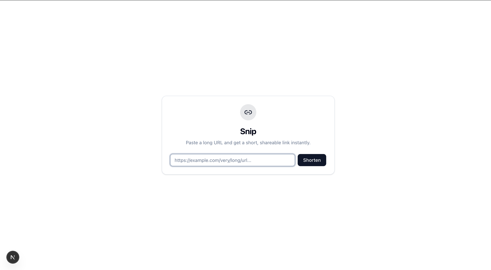

# Snip — URL Shortener

URL shortener ที่ผมทำเพื่อลองเล่น **caching strategy** จริงจัง — ใช้ Redis เป็น layer หน้า Postgres แล้ว deploy ขึ้น Vercel ทั้งหมดบน free tier

> **Live demo:** [sniplink-earthchx.vercel.app](https://sniplink-earthchx.vercel.app)



---

## ทำไมถึงทำ project นี้

อยากลองออกแบบ backend ที่คิดเรื่อง performance ตั้งแต่ต้น ไม่ใช่แค่ CRUD ธรรมดา เลยเลือก URL shortener เพราะมันเป็น problem ที่เล็กพอจะทำคนเดียว แต่มี design decisions ที่น่าสนใจเยอะ เช่น:

- **จะสร้าง short code ยังไงให้ไม่ซ้ำ** โดยไม่ต้อง check DB ทุกครั้ง?
- **จะ redirect ให้เร็วได้แค่ไหน** ถ้าวาง cache ดีๆ?
- **จะป้องกัน spam** ยังไง โดยไม่กระทบ UX?

---

## สิ่งที่น่าสนใจในโปรเจกต์นี้

### Short Code Generation — Redis INCR + Base62

ใช้ Redis `INCR` (atomic counter) แทน UUID หรือ random string เพราะ:

- **Zero collision** — ทุก request ได้เลขไม่ซ้ำกัน
- **สั้น** — `10000` → `"2Bi"` (3 ตัวอักษร), 6 ตัวอักษรรองรับ ~56 พันล้าน IDs
- **เร็ว** — O(1), ไม่ต้อง round-trip ไป DB

### Caching — Redis → Postgres

Redirect (`GET /2Bi`) ใช้ cache-aside pattern:

```
1. Check Redis cache → hit? → 302 redirect (~5ms)
2. Cache miss → query Neon Postgres → populate cache → redirect
3. Visit counter++ แบบ fire-and-forget (ไม่ block response)
```

ตอนสร้าง link ใหม่ก็ cache ทั้งสองทิศทาง:
- `code → url` สำหรับ redirect
- `url → code` สำหรับ dedup (ส่ง URL ซ้ำ → ได้ code เดิม)

### Rate Limiting ที่ Edge

Sliding window rate limit (10 req / 60s per IP) ทำงานที่ Edge ก่อนถึง API route — spam ถูก block ตั้งแต่ layer แรก โดยไม่กระทบ redirect performance

---

## Tech Stack

| | Technology | ทำไมถึงเลือก |
|---|---|---|
| **Framework** | Next.js 16 (App Router) | Server Actions, Edge Runtime |
| **Database** | [Neon](https://neon.tech) Postgres | Serverless, scale to zero, free tier |
| **Cache** | [Upstash](https://upstash.com) Redis | HTTP-based (Edge-compatible), atomic INCR |
| **ORM** | Drizzle | Type-safe, lightweight |
| **Deploy** | [Vercel](https://vercel.com) | Push to GitHub → deploy, free tier |
| **UI** | shadcn/ui + Tailwind | ไม่ใช่ focus หลัก แต่ก็ดูดีในระดับนึง |

ทุกอย่างเป็น **HTTP-based** หมด — ไม่ต้อง TCP connection, ทำงานบน Edge Runtime ได้เลย

---

## Getting Started

**ต้องมี:** [Bun](https://bun.sh/), account [Neon](https://console.neon.tech/) + [Upstash](https://console.upstash.com/) (free tier)

```bash
git clone https://github.com/earthchx/url-shortener
cd url-shortener
bun install
cp .env.example .env.local   # แล้วใส่ credentials
bun run db:push               # สร้าง table ใน Neon
bun dev                        # เปิด http://localhost:3000
```

### Environment Variables

| Variable | ได้จากไหน |
|---|---|
| `DATABASE_URL` | Neon Console → Connection string |
| `UPSTASH_REDIS_REST_URL` | Upstash Console → REST API |
| `UPSTASH_REDIS_REST_TOKEN` | Upstash Console → REST API |
| `NEXT_PUBLIC_BASE_URL` | `http://localhost:3000` (dev) หรือ domain จริง |

---

## Deploy

```bash
# Push ขึ้น GitHub แล้วไป vercel.com/new → Import → ใส่ env vars → Deploy
```

แค่นั้นเลย Neon กับ Upstash ใช้ HTTP driver หมด ไม่ต้อง config อะไรเพิ่ม

---

## API

**สร้าง short link:**

```bash
curl -X POST http://localhost:3000/api/shorten \
  -H 'Content-Type: application/json' \
  -d '{"url": "https://example.com/long-url"}'

# → { "success": true, "shortUrl": "http://localhost:3000/2Bi", "shortCode": "2Bi" }
```

**Redirect:**

```
GET /2Bi → 302 redirect → https://example.com/long-url
```

---

## License

MIT
